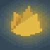
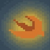
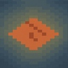

# Hi, I'm Doris Maltes! 👋

<h2 align="center">Computer Systems Engineer ⋆.𐙚 ̊</h2>

  

<h3>📱 iOS Developer | 🎨 UX Lover | 🌎 Mexican | 🦎 Axolotl Enthusiast</h3>

- 💡 I love combining design and code
- 🔧 Currently building AI + chat tools
- 🚀 Looking for international internship opportunities

<h3 align="center">Tech Stack ◡̈ </h3>

  

  
  
  
  

  
  
  
  
  

## 💫 About Me

Hi! I'm **Doris Maltes** 👋  
A passionate iOS & web developer from 🇲🇽 Mexico, currently exploring the world of tech and creativity.

- 🎓 Computer Systems Engineering student  
- 💻 Love building apps with **SwiftUI**, **React**, and a touch of ✨design  
- 🦎 Axolotl fan & color lover  
- 🌱 Currently learning more about **AI** and cloud technologies

> “Code is poetry, and I love writing beautiful things.”

Let's connect and build something magical! 💫

